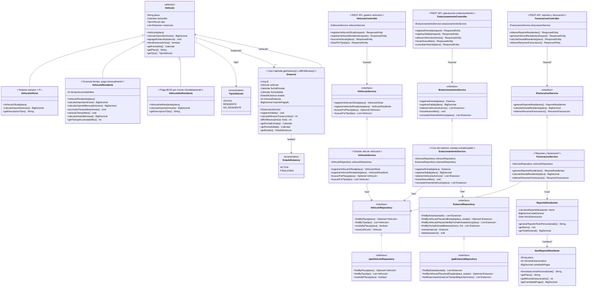

# Diagrama de Clases - Sistema de Estacionamiento

```mermaid
classDiagram
    %% =====================================
    %% DOMAIN LAYER - ENTIDADES PRINCIPALES
    %% =====================================
    
    class Vehiculo {
        <<abstract>>
        -String placa
        -Calendar fechaAlta
        -TipoVehiculo tipo
        -List~Estancia~ estancias
        +Vehiculo(placa)
        +calcularImporte(minutos)* BigDecimal
        +agregarEstancia(estancia) void
        +tieneEstanciaActiva() boolean
        +getFechaAlta() Calendar
        +getPlaca() String
        +getTipo() TipoVehiculo
    }

    class VehiculoOficial {
        +VehiculoOficial(placa)
        +calcularImporte(minutos) BigDecimal
        +getDescripcionTipo() String
        <<"Importe siempre = 0">>
    }

    class VehiculoResidente {
        -int tiempoAcumuladoMes
        +VehiculoResidente(placa)
        +calcularImporte(minutos) BigDecimal
        +calcularImporteMensual(minutos) BigDecimal
        +acumularTiempoMes(minutos) void
        +reiniciarTiempoMes() void
        +calcularDeudaMensual() BigDecimal
        +getTiempoAcumuladoMes() int
        <<"Acumula tiempo, paga mensualmente">>
    }

    class VehiculoNoResidente {
        +VehiculoNoResidente(placa)
        +calcularImporte(minutos) BigDecimal
        +getDescripcionTipo() String
        <<"Paga $0.50 por minuto inmediatamente">>
    }

    class Estancia {
        -Long id
        -Vehiculo vehiculo
        -Calendar fechaEntrada
        -Calendar fechaSalida
        -EstadoEstancia estado
        -int minutosEstancia
        -BigDecimal importePagado
        +Estancia(vehiculo)
        +registrarSalida() void
        +calcularMinutosTranscurridos() int
        -difEnMinutos(inicial, final) int
        +getFechaEntrada() Calendar
        +getFechaSalida() Calendar
        +getEstado() EstadoEstancia
        <<"Usa Calendar.getInstance() y difEnMinutos()">>
    }

    %% =====================================
    %% DOMAIN LAYER - ENUMS Y VALUE OBJECTS
    %% =====================================

    class TipoVehiculo {
        <<enumeration>>
        OFICIAL
        RESIDENTE
        NO_RESIDENTE
    }

    class EstadoEstancia {
        <<enumeration>>
        ACTIVA
        FINALIZADA
    }

    %% =====================================
    %% DOMAIN LAYER - REPOSITORY INTERFACES
    %% =====================================

    class VehiculoRepository {
        <<interface>>
        +findByPlaca(placa) Optional~Vehiculo~
        +findByTipo(tipo) List~Vehiculo~
        +existsByPlaca(placa) boolean
        +save(vehiculo) Vehiculo
    }

    class EstanciaRepository {
        <<interface>>
        +findByEstado(estado) List~Estancia~
        +findByVehiculoPlacaAndEstado(placa, estado) Optional~Estancia~
        +findByVehiculoPlacaOrderByFechaEntradaDesc(placa) List~Estancia~
        +findByFechaEntradaBetween(inicio, fin) List~Estancia~
        +save(estancia) Estancia
        +delete(estancia) void
    }

    %% =====================================
    %% APPLICATION LAYER - SERVICE INTERFACES
    %% =====================================

    class IEstacionamientoService {
        <<interface>>
        +registrarEntrada(placa) Estancia
        +registrarSalida(placa) BigDecimal
        +obtenerVehiculosActivos() List~Estancia~
        +iniciarNuevoMes() void
        +consultarHistorialVehiculo(placa) List~Estancia~
    }

    class IVehiculoService {
        <<interface>>
        +registrarVehiculoOficial(placa) VehiculoOficial
        +registrarVehiculoResidente(placa) VehiculoResidente
        +buscarPorPlaca(placa) Optional~Vehiculo~
        +buscarPorTipo(tipo) List~Vehiculo~
    }

    class IFacturacionService {
        <<interface>>
        +generarReporteResidentes() ReporteResidentes
        +calcularDeudaResidente(placa) BigDecimal
        +obtenerResumenFacturacion() ResumenFacturacion
    }

    %% =====================================
    %% APPLICATION LAYER - SERVICE IMPLEMENTATIONS
    %% =====================================

    class EstacionamientoService {
        -VehiculoRepository vehiculoRepository
        -EstanciaRepository estanciaRepository
        +registrarEntrada(placa) Estancia
        +registrarSalida(placa) BigDecimal
        +obtenerVehiculosActivos() List~Estancia~
        +iniciarNuevoMes() void
        +consultarHistorialVehiculo(placa) List~Estancia~
        <<"Core del sistema: maneja entrada/salida">>
    }

    class VehiculoService {
        -VehiculoRepository vehiculoRepository
        +registrarVehiculoOficial(placa) VehiculoOficial
        +registrarVehiculoResidente(placa) VehiculoResidente
        +buscarPorPlaca(placa) Optional~Vehiculo~
        +buscarPorTipo(tipo) List~Vehiculo~
        <<"Gestión alta de vehículos">>
    }

    class FacturacionService {
        -VehiculoRepository vehiculoRepository
        +generarReporteResidentes() ReporteResidentes
        +calcularDeudaResidente(placa) BigDecimal
        +obtenerResumenFacturacion() ResumenFacturacion
        <<"Reportes y facturación">>
    }

    %% =====================================
    %% WEB LAYER - REST CONTROLLERS
    %% =====================================

    class EstacionamientoController {
        -IEstacionamientoService estacionamientoService
        +registrarEntrada(request) ResponseEntity
        +registrarSalida(request) ResponseEntity
        +obtenerVehiculosActivos() ResponseEntity
        +iniciarNuevoMes() ResponseEntity
        +consultarHistorial(placa) ResponseEntity
        <<"REST API: operaciones estacionamiento">>
    }

    class VehiculoController {
        -IVehiculoService vehiculoService
        +registrarVehiculoOficial(request) ResponseEntity
        +registrarVehiculoResidente(request) ResponseEntity
        +buscarVehiculo(placa) ResponseEntity
        +listarPorTipo(tipo) ResponseEntity
        <<"REST API: gestión vehículos">>
    }

    class FacturacionController {
        -IFacturacionService facturacionService
        +obtenerReporteResidentes() ResponseEntity
        +generarInformeResidentes(request) ResponseEntity
        +calcularDeudaResidente(placa) ResponseEntity
        +obtenerResumenFacturacion() ResponseEntity
        <<"REST API: reportes y facturación">>
    }

    %% =====================================
    %% APPLICATION LAYER - DTOs
    %% =====================================

    class ReporteResidentes {
        -List~ItemReporteResidente~ items
        -BigDecimal totalGeneral
        -Date fechaGeneracion
        +generarReporteTextoPersonalizado() String
        +getItems() List
        +getTotalGeneral() BigDecimal
    }

    class ItemReporteResidente {
        -String placa
        -int minutosEstacionados
        -BigDecimal cantidadAPagar
        +formatearLineaPersonalizada() String
        +getPlaca() String
        +getMinutosEstacionados() int
        +getCantidadAPagar() BigDecimal
    }

    %% =====================================
    %% INFRASTRUCTURE LAYER - JPA
    %% =====================================

    class JpaVehiculoRepository {
        <<interface>>
        <<"extends JpaRepository~Vehiculo, String~">>
        <<"implements VehiculoRepository">>
        +findByPlaca(placa) Optional~Vehiculo~
        +findByTipo(tipo) List~Vehiculo~
        +existsByPlaca(placa) boolean
    }

    class JpaEstanciaRepository {
        <<interface>>
        <<"extends JpaRepository~Estancia, Long~">>
        <<"implements EstanciaRepository">>
        +findByEstado(estado) List~Estancia~
        +findByVehiculoPlacaAndEstado(placa, estado) Optional~Estancia~
        +findEstanciasActivasConTiempoMayorA(minutos) List~Estancia~
    }

    %% =====================================
    %% RELACIONES - HERENCIA
    %% =====================================
    Vehiculo <|-- VehiculoOficial
    Vehiculo <|-- VehiculoResidente
    Vehiculo <|-- VehiculoNoResidente

    %% =====================================
    %% RELACIONES - COMPOSICIÓN Y AGREGACIÓN
    %% =====================================
    Vehiculo --> TipoVehiculo : "tipo"
    Vehiculo "1" --> "0..*" Estancia : "estancias"
    Estancia --> EstadoEstancia : "estado"
    Estancia --> Vehiculo : "vehiculo"

    %% =====================================
    %% RELACIONES - IMPLEMENTACIÓN INTERFACES
    %% =====================================
    IEstacionamientoService <|.. EstacionamientoService
    IVehiculoService <|.. VehiculoService
    IFacturacionService <|.. FacturacionService

    VehiculoRepository <|.. JpaVehiculoRepository
    EstanciaRepository <|.. JpaEstanciaRepository

    %% =====================================
    %% RELACIONES - DEPENDENCIAS SERVICIOS
    %% =====================================
    EstacionamientoService --> VehiculoRepository : "usa"
    EstacionamientoService --> EstanciaRepository : "usa"
    VehiculoService --> VehiculoRepository : "usa"
    FacturacionService --> VehiculoRepository : "usa"

    %% =====================================
    %% RELACIONES - CONTROLLER A SERVICE
    %% =====================================
    EstacionamientoController --> IEstacionamientoService : "inyecta"
    VehiculoController --> IVehiculoService : "inyecta"
    FacturacionController --> IFacturacionService : "inyecta"

    %% =====================================
    %% RELACIONES - DTOS
    %% =====================================
    FacturacionService --> ReporteResidentes : "crea"
    ReporteResidentes --> ItemReporteResidente : "contiene"


```
