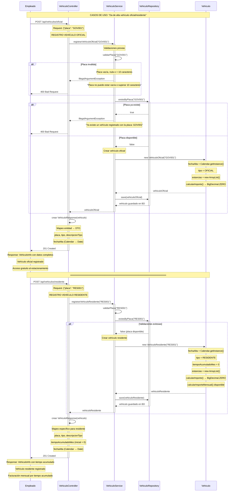

#  Casos de Uso: "Alta de Vehículos"

## Empleado registra vehículos oficiales y de residentes

```mermaid
sequenceDiagram
    participant Usuario as  Empleado
    participant VehController as VehiculoController
    participant VehService as VehiculoService
    participant VehRepo as VehiculoRepository
    participant Vehiculo as Vehiculo

    Note over Usuario, Vehiculo: CASOS DE USO: "Da de alta vehículo oficial/residente"

    %% =====================================
    %% ALTA VEHÍCULO OFICIAL
    %% =====================================

    Usuario->>+VehController: POST /api/vehiculos/oficial
    Note over VehController: Request: {"placa": "GOV001"}
    
    Note over VehController:  REGISTRO VEHÍCULO OFICIAL
    
    VehController->>+VehService: registrarVehiculoOficial("GOV001")
    
    Note over VehService:  Validaciones previas
    
    VehService->>VehService: validarPlaca("GOV001")
    alt  Placa inválida
        Note over VehService:  Placa vacía, nula o > 10 caracteres
        VehService-->>VehController: IllegalArgumentException
        Note over VehService: "Placa no puede estar vacía o superar 10 caracteres"
        VehController-->>Usuario: 400 Bad Request
    end
    
    VehService->>+VehRepo: existsByPlaca("GOV001")
    alt  Placa ya existe
        VehRepo-->>VehService: true
        VehService-->>VehController: IllegalArgumentException
        Note over VehService: "Ya existe un vehículo registrado con la placa: GOV001"
        VehController-->>Usuario: 400 Bad Request
    else  Placa disponible
        VehRepo-->>VehService: false
        
        Note over VehService:  Crear vehículo oficial
        
        VehService->>+Vehiculo: new VehiculoOficial("GOV001")
        Note over Vehiculo:  fechaAlta = Calendar.getInstance()
        Note over Vehiculo:  tipo = OFICIAL
        Note over Vehiculo:  estancias = new ArrayList()
        Note over Vehiculo:  calcularImporte() → BigDecimal.ZERO
        Vehiculo-->>VehService: vehiculoOficial
        
        VehService->>VehRepo: save(vehiculoOficial)
        VehRepo-->>-VehService: vehiculo guardado en BD
        
        VehService-->>-VehController: vehiculoOficial
    end
    
    VehController->>VehController: crear VehiculoResponse(vehiculo)
    Note over VehController:  Mapeo entidad → DTO
    Note over VehController: placa, tipo, descripcionTipo
    Note over VehController: fechaAlta (Calendar → Date)
    
    VehController-->>-Usuario:  201 Created
    Note over Usuario: Response: VehiculoInfo con datos completos
    Note over Usuario:  Vehículo oficial registrado
    Note over Usuario:  Acceso gratuito al estacionamiento

    %% =====================================
    %% SEPARADOR VISUAL
    %% =====================================
    
    Note over Usuario, Vehiculo: ═══════════════════════════════════════════════════════════

    %% =====================================
    %% ALTA VEHÍCULO RESIDENTE  
    %% =====================================

    Usuario->>+VehController: POST /api/vehiculos/residente
    Note over VehController: Request: {"placa": "RES001"}
    
    Note over VehController:  REGISTRO VEHÍCULO RESIDENTE
    
    VehController->>+VehService: registrarVehiculoResidente("RES001")
    
    VehService->>VehService: validarPlaca("RES001")
    VehService->>+VehRepo: existsByPlaca("RES001")
    
    alt  Validaciones exitosas
        VehRepo-->>VehService: false (placa disponible)
        
        Note over VehService:  Crear vehículo residente
        
        VehService->>+Vehiculo: new VehiculoResidente("RES001")
        Note over Vehiculo:  fechaAlta = Calendar.getInstance()
        Note over Vehiculo:  tipo = RESIDENTE
        Note over Vehiculo:  tiempoAcumuladoMes = 0
        Note over Vehiculo:  estancias = new ArrayList()
        Note over Vehiculo:  calcularImporte() → BigDecimal.ZERO
        Note over Vehiculo:  calcularImporteMensual() disponible
        Vehiculo-->>VehService: vehiculoResidente
        
        VehService->>VehRepo: save(vehiculoResidente)
        VehRepo-->>-VehService: vehiculo guardado en BD
        
        VehService-->>-VehController: vehiculoResidente
    end
    
    VehController->>VehController: crear VehiculoResponse(vehiculo)
    Note over VehController:  Mapeo específico para residente
    Note over VehController: placa, tipo, descripcionTipo
    Note over VehController: tiempoAcumuladoMes (inicial = 0)
    Note over VehController: fechaAlta (Calendar → Date)
    
    VehController-->>-Usuario:  201 Created
    Note over Usuario: Response: VehiculoInfo con tiempo acumulado
    Note over Usuario:  Vehículo residente registrado
    Note over Usuario:  Facturación mensual por tiempo acumulado
```
