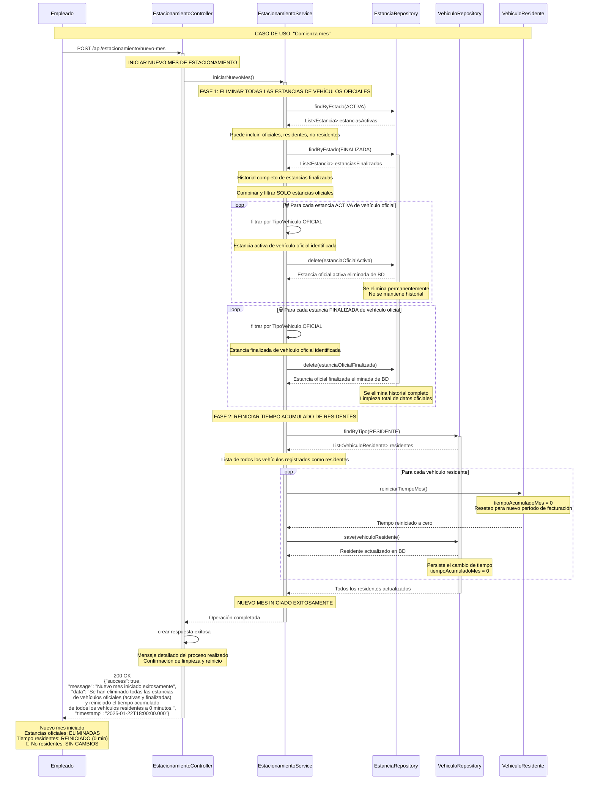

# Caso de Uso: "Comienza mes"

## Empleado inicia nuevo mes eliminando estancias oficiales y reiniciando tiempo de residentes

```mermaid
sequenceDiagram
    participant Usuario as  Empleado
    participant Controller as EstacionamientoController
    participant Service as EstacionamientoService
    participant EstRepo as EstanciaRepository
    participant VehRepo as VehiculoRepository
    participant Residente as VehiculoResidente

    Note over Usuario, Residente: CASO DE USO: "Comienza mes"

    Usuario->>+Controller: POST /api/estacionamiento/nuevo-mes
    
    Note over Controller:  INICIAR NUEVO MES DE ESTACIONAMIENTO
    
    Controller->>+Service: iniciarNuevoMes()
    
    Note over Service:  FASE 1: ELIMINAR TODAS LAS ESTANCIAS DE VEHÍCULOS OFICIALES

    Service->>+EstRepo: findByEstado(ACTIVA)
    EstRepo-->>Service: List<Estancia> estanciasActivas
    Note over Service:  Puede incluir: oficiales, residentes, no residentes
    
    Service->>+EstRepo: findByEstado(FINALIZADA)
    EstRepo-->>Service: List<Estancia> estanciasFinalizadas
    Note over Service:  Historial completo de estancias finalizadas
    
    Note over Service:  Combinar y filtrar SOLO estancias oficiales

    loop 🗑️ Para cada estancia ACTIVA de vehículo oficial
        Service->>Service: filtrar por TipoVehiculo.OFICIAL
        Note over Service: Estancia activa de vehículo oficial identificada
        
        Service->>EstRepo: delete(estanciaOficialActiva)
        EstRepo-->>Service:  Estancia oficial activa eliminada de BD
        Note over EstRepo:  Se elimina permanentemente<br/>No se mantiene historial
    end

    loop 🗑️ Para cada estancia FINALIZADA de vehículo oficial
        Service->>Service: filtrar por TipoVehiculo.OFICIAL
        Note over Service:  Estancia finalizada de vehículo oficial identificada
        
        Service->>EstRepo: delete(estanciaOficialFinalizada)
        EstRepo-->>-Service:  Estancia oficial finalizada eliminada de BD
        Note over EstRepo:  Se elimina historial completo<br/>Limpieza total de datos oficiales
    end

    Note over Service:  FASE 2: REINICIAR TIEMPO ACUMULADO DE RESIDENTES

    Service->>+VehRepo: findByTipo(RESIDENTE)
    VehRepo-->>Service: List<VehiculoResidente> residentes
    Note over Service:  Lista de todos los vehículos registrados como residentes

    loop  Para cada vehículo residente
        Service->>+Residente: reiniciarTiempoMes()
        Note over Residente:  tiempoAcumuladoMes = 0<br/> Reseteo para nuevo período de facturación
        Residente-->>Service:  Tiempo reiniciado a cero
        
        Service->>VehRepo: save(vehiculoResidente)
        VehRepo-->>Service:  Residente actualizado en BD
        Note over VehRepo:  Persiste el cambio de tiempo<br/>tiempoAcumuladoMes = 0
    end

    VehRepo-->>-Service:  Todos los residentes actualizados

    Note over Service:  NUEVO MES INICIADO EXITOSAMENTE

    Service-->>-Controller:  Operación completada

    Controller->>Controller: crear respuesta exitosa
    Note over Controller:  Mensaje detallado del proceso realizado<br/>Confirmación de limpieza y reinicio

    Controller-->>-Usuario:  200 OK<br/>{"success": true,<br/> "message": "Nuevo mes iniciado exitosamente",<br/> "data": "Se han eliminado todas las estancias<br/>        de vehículos oficiales (activas y finalizadas)<br/>        y reiniciado el tiempo acumulado<br/>        de todos los vehículos residentes a 0 minutos.",<br/> "timestamp": "2025-01-22T18:00:00.000"}

    Note over Usuario:  Nuevo mes iniciado<br/> Estancias oficiales: ELIMINADAS<br/> Tiempo residentes: REINICIADO (0 min)<br/>👤 No residentes: SIN CAMBIOS
```
