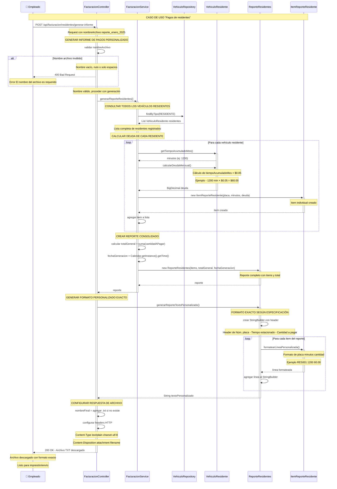

#  Caso de Uso: "Pagos de residentes"

## Empleado genera informe de pagos con formato personalizado

```mermaid
sequenceDiagram
    participant Usuario as 👤 Empleado
    participant Controller as FacturacionController
    participant Service as FacturacionService
    participant VehRepo as VehiculoRepository
    participant Residente as VehiculoResidente
    participant Reporte as ReporteResidentes
    participant Item as ItemReporteResidente

    Note over Usuario, Item: CASO DE USO "Pagos de residentes"

    Usuario->>+Controller: POST /api/facturacion/residentes/generar-informe
    Note over Controller: Request con nombreArchivo reporte_enero_2025
    
    Note over Controller:  GENERAR INFORME DE PAGOS PERSONALIZADO
    
    Controller->>Controller: validar nombreArchivo
    alt  Nombre archivo inválido
        Note over Controller:  Nombre vacío, nulo o solo espacios
        Controller-->>Usuario: 400 Bad Request
        Note over Usuario: Error El nombre del archivo es requerido
    end
    
    Note over Controller:  Nombre válido, proceder con generación
    
    Controller->>+Service: generarReporteResidentes()
    
    Note over Service:  CONSULTAR TODOS LOS VEHÍCULOS RESIDENTES
    
    Service->>+VehRepo: findByTipo(RESIDENTE)
    VehRepo-->>Service: List VehiculoResidente residentes
    Note over Service:  Lista completa de residentes registrados
    
    Note over Service:  CALCULAR DEUDA DE CADA RESIDENTE

    loop  Para cada vehículo residente
        Service->>+Residente: getTiempoAcumuladoMes()
        Residente-->>Service: minutos (ej: 1200)
        
        Service->>Residente: calcularDeudaMensual()
        Note over Residente:  Cálculo de tiempoAcumuladoMes × $0.05
        Note over Residente: Ejemplo - 1200 min × $0.05 = $60.00
        Residente-->>-Service: BigDecimal deuda
        
        Service->>+Item: new ItemReporteResidente(placa, minutos, deuda)
        Note over Item:  Item individual creado
        Item-->>-Service: item creado
        
        Service->>Service: agregar item a lista
    end

    Note over Service:  CREAR REPORTE CONSOLIDADO

    Service->>Service: calcular totalGeneral = suma(cantidadAPagar)
    Service->>Service: fechaGeneracion = Calendar.getInstance().getTime()
    
    Service->>+Reporte: new ReporteResidentes(items, totalGeneral, fechaGeneracion)
    Note over Reporte:  Reporte completo con items y total
    Reporte-->>-Service: reporte

    Service-->>-Controller: reporte

    Note over Controller:  GENERAR FORMATO PERSONALIZADO EXACTO

    Controller->>+Reporte: generarReporteTextoPersonalizado()
    
    Note over Reporte:  FORMATO EXACTO SEGÚN ESPECIFICACIÓN
    
    Reporte->>Reporte: crear StringBuilder con header
    Note over Reporte: Header de Núm. placa - Tiempo estacionado - Cantidad a pagar
    
    loop  Para cada item del reporte
        Reporte->>+Item: formatearLineaPersonalizada()
        Note over Item:  Formato de placa minutos cantidad
        Note over Item: Ejemplo RES001 1200 60.00
        Item-->>-Reporte: línea formateada
        Reporte->>Reporte: agregar línea al StringBuilder
    end
    
    Reporte-->>-Controller: String textoPersonalizado

    Note over Controller:  CONFIGURAR RESPUESTA DE ARCHIVO

    Controller->>Controller: nombreFinal = agregar .txt si no existe
    
    Controller->>Controller: configurar headers HTTP
    Note over Controller: Content-Type text/plain charset utf-8
    Note over Controller: Content-Disposition attachment filename

    Controller-->>-Usuario:  200 OK - Archivo TXT descargado

    Note over Usuario:  Archivo descargado con formato exacto
    Note over Usuario:  Listo para impresión/envío
```

