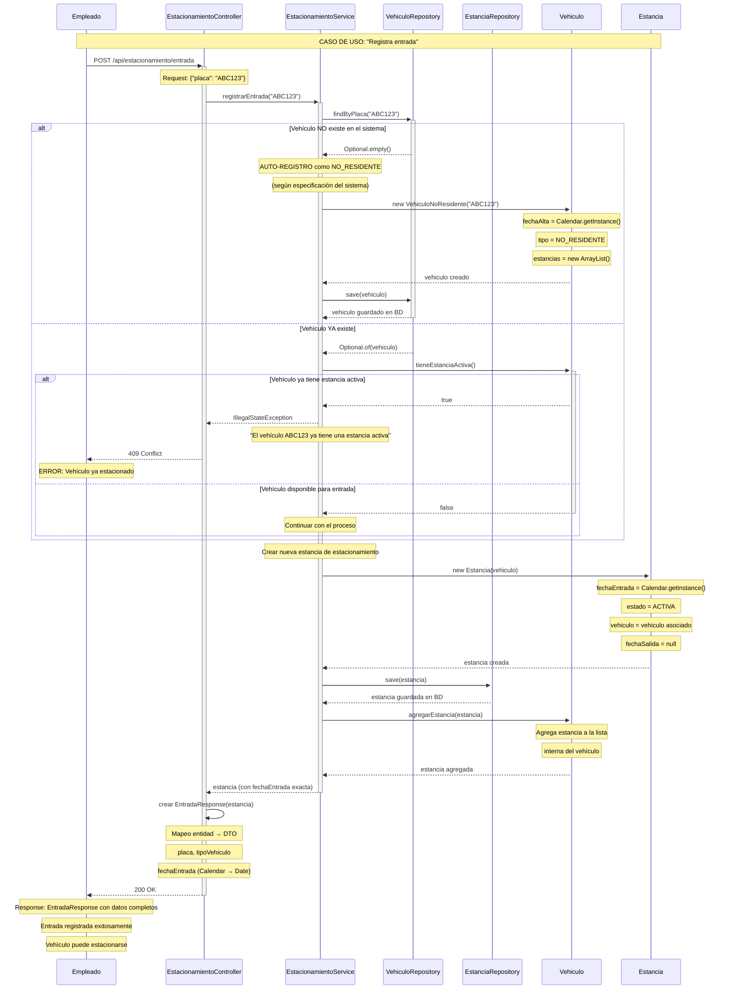

#  Caso de Uso: "Registra entrada"

## Empleado registra entrada de vehículo en el estacionamiento

```mermaid
sequenceDiagram
    participant Usuario as  Empleado
    participant Controller as EstacionamientoController
    participant Service as EstacionamientoService
    participant VehRepo as VehiculoRepository
    participant EstRepo as EstanciaRepository
    participant Vehiculo as Vehiculo
    participant Estancia as Estancia

    Note over Usuario, Estancia: CASO DE USO: "Registra entrada"

    Usuario->>+Controller: POST /api/estacionamiento/entrada
    Note over Controller: Request: {"placa": "ABC123"}
    
    Controller->>+Service: registrarEntrada("ABC123")
    
    Service->>+VehRepo: findByPlaca("ABC123")
    
    alt Vehículo NO existe en el sistema
        VehRepo-->>Service: Optional.empty()
        
        Note over Service:  AUTO-REGISTRO como NO_RESIDENTE
        Note over Service: (según especificación del sistema)
        
        Service->>+Vehiculo: new VehiculoNoResidente("ABC123")
        Note over Vehiculo: fechaAlta = Calendar.getInstance()
        Note over Vehiculo: tipo = NO_RESIDENTE
        Note over Vehiculo: estancias = new ArrayList()
        Vehiculo-->>Service: vehiculo creado
        
        Service->>VehRepo: save(vehiculo)
        VehRepo-->>-Service: vehiculo guardado en BD
        
    else Vehículo YA existe
        VehRepo-->>Service: Optional.of(vehiculo)
        
        Service->>+Vehiculo: tieneEstanciaActiva()
        
        alt  Vehículo ya tiene estancia activa
            Vehiculo-->>Service: true
            Service-->>Controller:  IllegalStateException
            Note over Service: "El vehículo ABC123 ya tiene una estancia activa"
            Controller-->>Usuario: 409 Conflict
            Note over Usuario:  ERROR: Vehículo ya estacionado
        else  Vehículo disponible para entrada
            Vehiculo-->>-Service: false
            Note over Service: Continuar con el proceso
        end
    end
    
    Note over Service:  Crear nueva estancia de estacionamiento
    
    Service->>+Estancia: new Estancia(vehiculo)
    Note over Estancia:  fechaEntrada = Calendar.getInstance()
    Note over Estancia:  estado = ACTIVA
    Note over Estancia:  vehiculo = vehiculo asociado
    Note over Estancia:  fechaSalida = null
    Estancia-->>Service: estancia creada
    
    Service->>+EstRepo: save(estancia)
    EstRepo-->>Service: estancia guardada en BD
    
    Service->>Vehiculo: agregarEstancia(estancia)
    Note over Vehiculo: Agrega estancia a la lista
    Note over Vehiculo: interna del vehículo
    Vehiculo-->>Service:  estancia agregada
    
    Service-->>-Controller: estancia (con fechaEntrada exacta)
    
    Controller->>Controller: crear EntradaResponse(estancia)
    Note over Controller:  Mapeo entidad → DTO
    Note over Controller: placa, tipoVehiculo
    Note over Controller: fechaEntrada (Calendar → Date)
    
    Controller-->>-Usuario:  200 OK
    Note over Usuario: Response: EntradaResponse con datos completos
    Note over Usuario:  Entrada registrada exitosamente
    Note over Usuario: Vehículo puede estacionarse
```

