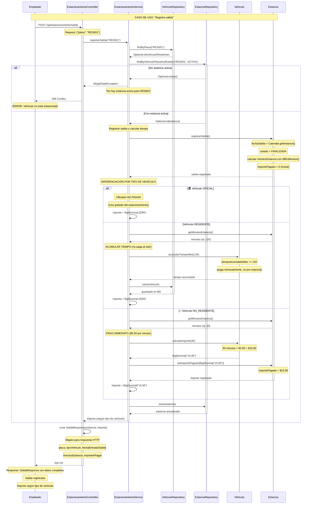

#  Caso de Uso: "Registra salida"

## Empleado registra salida con diferenciación por tipo de vehículo

```mermaid
sequenceDiagram
    participant Usuario as  Empleado
    participant Controller as EstacionamientoController
    participant Service as EstacionamientoService
    participant VehRepo as VehiculoRepository
    participant EstRepo as EstanciaRepository
    participant Vehiculo as Vehiculo
    participant Estancia as Estancia

    Note over Usuario, Estancia: CASO DE USO: "Registra salida"

    Usuario->>+Controller: POST /api/estacionamiento/salida
    Note over Controller: Request: {"placa": "RES001"}
    
    Controller->>+Service: registrarSalida("RES001")
    
    Service->>+VehRepo: findByPlaca("RES001")
    VehRepo-->>Service: Optional.of(vehiculoResidente)
    
    Service->>+EstRepo: findByVehiculoPlacaAndEstado("RES001", ACTIVA)
    
    alt  Sin estancia activa
        EstRepo-->>Service: Optional.empty()
        Service-->>Controller:  IllegalStateException
        Note over Service: "No hay estancia activa para RES001"
        Controller-->>Usuario: 409 Conflict
        Note over Usuario:  ERROR: Vehículo no está estacionado
        
    else  Con estancia activa
        EstRepo-->>Service: Optional.of(estancia)
        
        Note over Service:  Registrar salida y calcular tiempo
        
        Service->>+Estancia: registrarSalida()
        Note over Estancia:  fechaSalida = Calendar.getInstance()
        Note over Estancia:  estado = FINALIZADA
        Note over Estancia:  calcular minutosEstancia con difEnMinutos()
        Note over Estancia:  importePagado = 0 (inicial)
        Estancia-->>Service:  salida registrada
        
        Note over Service:  DIFERENCIACIÓN POR TIPO DE VEHÍCULO
        
        alt 🏛️ Vehículo OFICIAL
            Note over Service:  Oficiales NO PAGAN
            Note over Service: (Uso gratuito del estacionamiento)
            Service->>Service: importe = BigDecimal.ZERO
            
        else  Vehículo RESIDENTE  
            Service->>Estancia: getMinutosEstancia()
            Estancia-->>Service: minutos (ej: 120)
            
            Note over Service:  ACUMULAR TIEMPO (no paga al salir)
            Service->>+Vehiculo: acumularTiempoMes(120)
            Note over Vehiculo: tiempoAcumuladoMes += 120
            Note over Vehiculo: (paga mensualmente, no por estancia)
            Vehiculo-->>Service:  tiempo acumulado
            
            Service->>VehRepo: save(vehiculo)
            VehRepo-->>-Service:  guardado en BD
            
            Service->>Service: importe = BigDecimal.ZERO
            
        else 👤 Vehículo NO_RESIDENTE
            Service->>Estancia: getMinutosEstancia()
            Estancia-->>Service: minutos (ej: 30)
            
            Note over Service:  PAGO INMEDIATO ($0.50 por minuto)
            Service->>+Vehiculo: calcularImporte(30)
            Note over Vehiculo: 30 minutos × $0.50 = $15.00
            Vehiculo-->>Service: BigDecimal("15.00")
            
            Service->>Estancia: setImportePagado(BigDecimal("15.00"))
            Note over Estancia:  importePagado = $15.00
            Estancia-->>-Service:  importe registrado
            
            Service->>Service: importe = BigDecimal("15.00")
        end
        
        Service->>EstRepo: save(estancia)
        EstRepo-->>-Service:  estancia actualizada
        
        Service-->>-Controller: importe (según tipo de vehículo)
    end
    
    Controller->>Controller: crear SalidaResponse(estancia, importe)
    Note over Controller:  Mapeo para respuesta HTTP
    Note over Controller: placa, tipoVehiculo, fechaEntrada/Salida
    Note over Controller: minutosEstancia, importeAPagar
    
    Controller-->>-Usuario:  200 OK
    Note over Usuario: Response: SalidaResponse con datos completos
    Note over Usuario:  Salida registrada
    Note over Usuario:  Importe según tipo de vehículo
```
